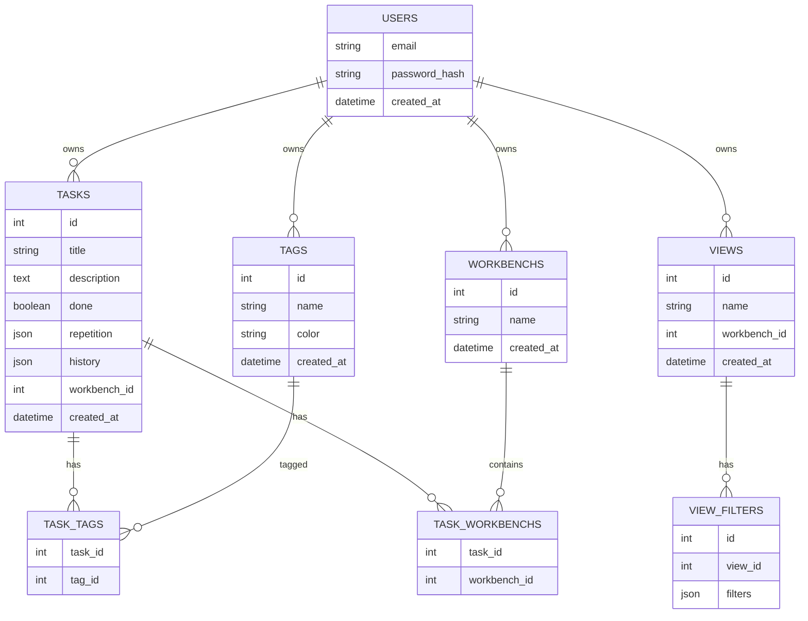
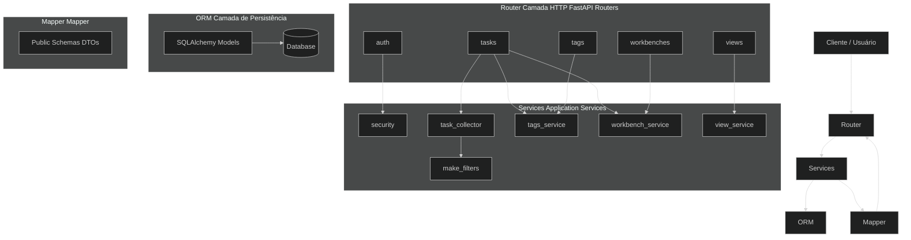

[](https://codecov.io/gh/bruno-gabriel-muniz/joker-task)


## Sobre o projeto

O **joker-task** é uma aplicação web de gerenciamento de tarefas em desenvolvimento que busca ser apenas o *espaço em branco* entre você e a conclusão das suas tarefas.

A ideia central é oferecer um sistema de organização **flexível**, **simples de manter** e **agnóstico a metodologias** específicas de produtividade.

Em vez de impor regras, o sistema fornece estruturas mínimas que podem ser combinadas livremente.

---

## Conceitos principais

O domínio do sistema é organizado em três conceitos centrais, além dos usuários:

- **Tasks**  
  Um único tipo de tarefa, capaz de representar diferentes estratégias de organização, como:
  - lembretes
  - quadros Kanban
  - trackers
  - ou tarefas simples, sem estrutura adicional

- **Workbenches**  
  Zonas de trabalho que facilitam a visualização recorrente de determinado conjunto de tarefas.

- **Views**  
  Filtros reutilizáveis que coletam tarefas com base em critérios específicos.

> A ideia é que qualquer técnica de organização surja da **combinação desses elementos**, e não de tipos rígidos de tarefas.

---

## Status atual

Atualmente, o projeto conta com:

- autenticação e autorização
- CRUD de tarefas e tags por usuário
- filtragem dinâmica de tarefas
- associação de tarefas via workbenches
- views reutilizáveis
- arquitetura modular com separação clara de responsabilidades
- testes automatizados com cobertura

O projeto está em evolução contínua, com foco em **qualidade de código**, **testabilidade** e **clareza arquitetural**.

---

## Sumário

- [Tecnologias Utilizadas](#tecnologias-utilizadas)
- [Como Começar?](#como-começar)
- [Estrutura do Projeto](#estrutura-do-projeto)
- [Database Schema](#database-schema)
- [Arquitetura](#arquitetura)
- [Próximos Passos](#próximos-passos)

---

## Tecnologias Utilizadas

- **Python**
- **FastAPI**
- **SQLAlchemy (async)**
- **Alembic**
- **Pytest**
- **Docker**

---

## Como Começar?

**Requisitos**: Python 3.13 e Poetry.

> O projeto foi pensado para ser usado via API (Swagger disponível em /docs).


#### Como baixar o projeto?
```
git clone https://github.com/bruno-gabriel-muniz/joker-task
```

#### Como instalar as dependências?
```
cd joker-task/backend
poetry install
```

#### Como rodar o projeto?
```
poetry run alembic upgrade head
poetry run task run
```

#### Como rodar os testes?
```
poetry run task testf
```

#### Como usar os linters?

```
poetry run task format
```

#### Rodando com Docker
```
docker compose up --build
```
---

## Estrutura do Projeto

```
.
├── backend
│   ├── joker_task
│   │   ├── db
│   │   │   ├── database.py
│   │   │   └── models.py
│   │   ├── interfaces
│   │   │   └── interfaces.py
│   │   ├── router
│   │   │   ├── auth.py
│   │   │   ├── tags.py
│   │   │   ├── tasks.py
│   │   │   ├── views.py
│   │   │   └── workbenches.py
│   │   ├── service
│   │   │   ├── dependencies.py
│   │   │   ├── make_filters.py
│   │   │   ├── mapper.py
│   │   │   ├── security.py
│   │   │   ├── tags_service.py
│   │   │   ├── task_collector.py
│   │   │   ├── view_service.py
│   │   │   └── workbench_service.py
│   │   ├── __init__.py
│   │   ├── app.py
│   │   ├── schemas.py
│   │   └── settings.py
│   ├── migrations
│   │   └── ...
│   ├── tests
│   │   └── ...
│   ├── poetry.lock
│   ├── pyproject.toml
│   └── README.md
├── docker-compose.yml
├── LICENSE
└── README.md
```
---

## Database Schema



---

## Arquitetura


---

### Principais módulos

- **auth**: Responsável pela autenticação e autorização.

- **security**: Implementa regras de segurança (tokens, hashing, validações).

- **tasks (router)**: Camada de entrada HTTP. Orquestra o fluxo da requisição.

- **task_collector**: Responsável por buscar tarefas no banco, aplicando filtros dinâmicos usando *Strategy* e o **make_filters**.

- **make_filters**: Camada que traduz os filtros para expressão SQL, utilizando o padrão *Factory*

- **tags_service**: Gerencia criação, reutilização, verificação de conflitos e associação de tags com as tasks.

- **workbench_service**: Gerencia coleta, verificação de conflitos e associação de workbenches com as tasks.

- **view_service**: Gerencia criação, reutilização, verificação de conflitos e associação de views com as tasks.

- **mapper**: Converte modelos ORM em schemas públicos, desacoplando banco de dados da API.

---

### Fluxo de chamadas

- `User → auth → security`
- `User → tasks → task_collector → mapper`
- `User → tasks → (tags_service, task_collector, workbench_service) → mapper`
- `User → tags → tags_service → mapper`
- `User → workbenches → workbench_service → mapper`
- `User → views → view_service → (task_collector) → mapper`

---

## Próximos Passos

- [X] Sistema de Login
- [X] Sistema de Logs
- [X] CRUD de Tasks
- [X] Router Tags
- [X] Integração com Workbenches
- [X] Filtros mais avançados (views reutilizáveis)
- [X] Evolução do domínio de Tags
- [X] Dockerizar o backend
- [ ] Iniciar desenvolvimento do frontend
- [ ] Implementação do sistema de repetição de tarefas
- [ ] Refatorações e melhorias arquiteturais contínuas

